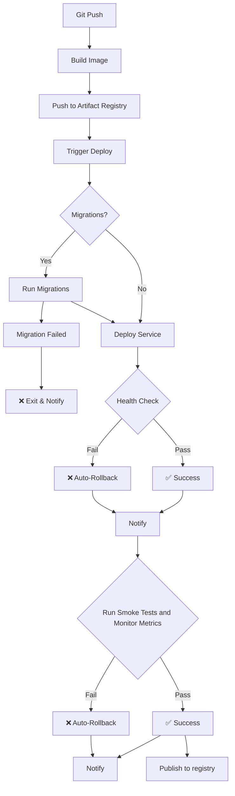

### Building an Internal Developer Platform for AI Agents

*How we built a production-grade platform for deploying AI agents and MCP servers at scale*

---

Platform Engineering has been all the rage for a while. I think for good reason [Why platform engineering will eat the world
](https://platformengineering.org/blog/why-platform-engineering-will-eat-the-world).

However, deploying AI agents to production is fundamentally different from deploying traditional web applications. 

Traditional IDPs [Internal Development Platforms](https://www.redhat.com/en/topics/platform-engineering/what-is-an-internal-developer-platform)
(usually) assume:
- stateless services 
- short-lived requests
- clear ownership boundaries

Agentic systems violate all three. Agents stress every layer of a platform simultaneously, execution, identity, observability,
cost, governance and lifecycle management. 

Agents need to communicate with each other, consume tools from MCP servers, call one or more LLM providers & maintain state. They need to scale dynamically responding to unpredictable workloads. 
They also need to do all this securely, with proper observability, and, ideally, without breaking the bank.

Most organizations face these challenges for wide-spread adoption. So how does one go about creating a platform that
makes deploying agents as simple as deploying a web app; abstracting all the complexity behind the scenes from the 
developers, data scientists or even business people that want to build agents with no-code / low-code tools, or (shockingly) 
vibe-code their way into it.

This is where building an IDP based on **primitives** (reusable building blocks) and **golden paths** (well-lit, 
opinionated ways of doing things) comes in. Let's have a look at how those differ between an IDP that supports
agentic workloads natively vs a more traditional IDP approach for web services.

---

## Platform Philosophy: Primitives + Golden Paths

### Primitives: The Building Blocks

Primitives are the fundamental, reusable components developers compose together. Think LEGO blocks each does one thing well, and you combine them to build complex systems.

Here's some practical examples:

- **Infrastructure Primitives** - Cloud resources expressed as IaC modules & stacks (k8s clusters, databases, IAM)
- **Application Primitives** - Helm charts, helm hooks, deployment patterns (canary, blue/green)
- **CI/CD Primitives** - Automated workflows for build, test, deploy, testing DB migrations (up/down)
- **Networking & Security** - Networking rules, tunnels, authentication, authorization
- **Observability** - Metrics, logging, tracing, alerts
- **Templates** - Scaffolding for applications

### Golden Paths: The Well-Lit Roads

Golden paths are the opinionated, well-documented ways to accomplish common tasks. They're not the *only* way to do 
something, but they're the path that has been optimized, secured, and automated. Developers can stray but they should 
not expect support from the platform team when deviating.

The 2 key golden paths here are:
1. Deploying an AI Agent
2. Deploying an MCP Server

Let's dive into some examples.

---

## Primitive Example: Unified Model Interface

One of our earliest decisions: **treat all model interaction as a platform concern**.

From an agent's perspective, there's no distinction between OpenAI, Azure OpenAI, Anthropic, Vertex AI, or even self-hosted 
custom or fine-tuned models. Everything is exposed through an AI Gateway.

This is not limited to text-based models but also embeddings, vision, audio - any modality is available through a common interface.

The developers are happy because:
- Switching models becomes configuration
- No provider specific SDKs to learn, no switching costs
- No API keys to manage, share, rotate and leak
- No networking configuration or resource provisioning required by individual dev teams

The platform team is happy because:
- Model deprecations are handled at platform layer
- Load balancing and retries work uniformly
- Cost attribution happens automatically
- Regional failovers happen transparently

The cybersec team is happy because:
- Prompt injection prevention applies to all models
- Input/output compliance checks are consistent
- Supply chain risks are centrally managed (for example by sanitizing ingested documents in RAG pipelines from malicious embeddings)

This abstraction ensures loose coupling between agent logic and AI infrastructure. A cornerstone of distributed systems design, now applied to agentic workloads.

**The platform primitive:** AI Gateway acts as a unifying control plane for all model calls, regardless of modality or provider.

---

## Primitive Example: The Helper Helm Chart

One of our most powerful primitives is the Helper Helm chart. It's a foundation that every application builds on.

It allows us to:
- Turn all our deployments into Knative services (serverless, scale to zero - important if anyone can deploy an agent that may idle for long periods) 
- Inject automatically relevant labels / annotations to enable DataDog's APM
- Maintain a unified tagging system with proper attribution and ownership of resources
- Enforce limits to requested resources
- Automate how we handle DB migrations (with Helm hooks)
- Automate Virtual Service creation to route to new host (namespace level policies handle AuthN - secure by default)
- Ensure hardened security contexts (non-root, read-only filesystem, dropped capabilities)
- Autoscale (concurrency, RPS, or CPU/memory-based)

---

## Golden Path Example: Deploying an AI Agent

Here's an example of how the golden path for agent deployment might work:

1.  Developer Creates Agent
2.  Platform Team Provisions Infrastructure Using Terraform primitives:
3.  Developer or Platform Team Create Helm Chart (declaring helper chart dependency) and populates secrets in vault
4.  Push to Git -> GitOps workflow takes over

Apart from offering the primitives and documenting the journey, reference implementations are also provided for developers. 
These are real-world deployed and live applications that serve as minimal examples. IaC and charts might explain for example
how we connect to a database but might not demonstrate how we handle connection pooling. These can be part of a Cookiecutter, 
GitHub or Backstage template but there are diminishing returns when the templates are bloated and provide more scaffolding
than a developer might need at the time.

The Golden Path for an MCP server looks no different really to that of an agent.

---

## Security By Default, Not By Choice

If security is optional, it won't happen.

All deployed services get:
- JWT authentication (unless explicitly public)
- Workload Identity
- Encrypted secrets (synced automatically)
- Hardened containers (non-root, read-only FS)
- Network policies

It's not an opt-in model for developers. 

---

## Observability: Reconstructing Intent, Not Just Timelines

The fan-out pattern of A2A task delegation and MCP tool consumption by agents really pushes the limits of our observability solutions.

A single agent invocation can:
- Delegate work to three other agents in parallel
- Continue executing while waiting for async responses
- Reconcile partial results as they arrive in unpredictable order
- Make decisions based on incomplete information

This is where chronological traces across distributed systems might not help us put the puzzle pieces back together.

What really helps us understand the ordered execution, current context and intent is **session replay**.

The ability to reconstruct an agent's execution as it actually unfolded in a system where execution is inherently non-linear:
- Which decisions were made and when
- What was delegated and to whom
- Which paths were explored and abandoned
- Which results were incorporated or ignored
- Why a specific tool was invoked at a specific reasoning step

This might not be primarily a platform concern, but the data scientists, MLEs, prompt engineers and the likes that are
building a system will often times want to get a glimpse of understanding at how these magic black boxes reason and make decisions.
And these are the people we are serving as a platform team.

**The primitive:** Execution history that can be replayed, paused, rewound, and analyzed from the agent's perspective.

---

## Active Challenges

We're still learning in several areas:

### 1. Authorization in Delegation Chains

Traditional authorization asks: "Is user X allowed to do Y?"

Agentic systems ask: "Is user X allowed to do Y **via agent A**, which delegates to **tool T** on **MCP server M**?"

The problem:
- User may be authorized, but specific agent shouldn't invoke that tool
- Agent-to-agent delegation creates complex authorization chains
- Policy conflicts when user, agent, tool, and workspace constraints overlap

Solutions being assessed:
- Separate user authorization from agent/tool constraints
- Enforce invocation boundaries at gateway layer

Bits we still haven't figured out:
- Policy authoring, ownership, validation
- Explainability: "Why was this delegation or tool call rejected?"

### 2. Durable Execution: State & Memory Management

Agents are stateful but we've spent the last few decades in software decoupling (or loosely coupling) systems and going
stateless to increase resiliency. 

The problem:
- Agents accumulate context, reason over prior steps, coordinate over time
- Long-running sessions tied to in-memory state are brittle and opaque

Solutions being assessed:
- Externalize all state (context checkpointed to databases)
- Short, bounded execution steps
- Memory loaded on-demand, unloaded when idle
- Durable execution frameworks that provide retries, backoff, recovery

Bits we still haven't figured out:
- Efficient checkpointing strategies for long-running workflows
- Memory scoping: what to keep, what to discard, when

---

## Conclusion

Six months ago, we set out to build a platform that could deploy AI agents as easily as web apps. We've come a long way
and learned a lot. 

The road has been paved with challenges as everyone in the industry grapples with figuring out how to put agents in 
production at scale, securely. The torrential explosion of new tooling, keeping up with advancements, evolution of protocols
and the constant upskilling required is only a small part of the challenge. 

Our thinking about platforms, well established software patterns has been fundamentally questioned. In response to this, 
we tried to see how much we can pull back and translate all the new things into good old boring software. See where it fails 
and only compensate with new solution where truly necessary. I think this philosophy has served us well so far.

The reality of it is that agents don't fit the mold. They're stateful in a world built for stateless. They create authorization chains that break traditional identity models.

But what we do know is that they are here to stay. So we've full embraced them, and we're striving to find ways to allow
every member of our teams to be able to develop and deploy their own agents and MCP servers easily, and securely. 

For us, primitives enabling the platform team and golden paths guiding developers have been the difference between agents stuck 
in proof-of-concept hell and agents running in production.

**The platform handles complexity. Developers build agents. And agents (finally) ship to production.**

---